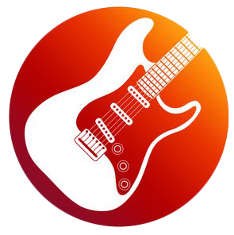

    
   

  <h1><b>Rock Festival</b></h1>

<!-- TABLE OF CONTENTS -->

## 📗 Table of Contents

- [📖 About the Project](#about-project)
  - [🛠 Built With](#built-with)
    - [Tech Stack](#tech-stack)
    - [Key Features](#key-features)
  - [🚀 Live Demo](#live-demo)
- [💻 Getting Started](#getting-started)
  - [Setup](#setup)
- [👥 Authors](#authors)
- [🔭 Future Features](#future-features)
- [🤝 Contributing](#contributing)
- [⭐️ Show your support](#support)
- [🙏 Acknowledgements](#acknowledgements)
- [📝 License](#license)

<!-- PROJECT DESCRIPTION -->

## 📖 Project Summary 

Rockfest is a responsive, well-designed, website template for music events, concerts, festivals, night club and more. Rockfest is built with modern technologies like HTML5, CSS3, Bootstrap and CSS3 Animation. Rockfest websites shows rock festival which is a series of musical performances by a variety of artists, which generally take place over a number of days. Some festivals are singular events, while others recur annually in the same location.

### 🛠 Built With 

#### Tech Stack 

- Html
- CSS3
- Flexbox
- CSS Grid
- Bootstrap
- Heroicons

<!-- Features -->

### Key Features 

- **Home Page**
- **About Page**

<!-- GETTING STARTED -->

<!-- LIVE DEMO -->

## 🚀 Live Demo 

Here is a link to my project. You can view to show the output so far.
[Live Demo](https://stephen-adom.github.io/rockfest/)

## 💻 Getting Started 

To get a local copy up and running, follow these steps.

### Setup

Clone this repository to your desired folder:

    cd my-folder
    git clone https://github.com/Stephen-Adom/rockfest.git
    open the directory in vscode and serve the index.html in live server

### 👥 Authors 

👤 **Stephen Addae**

- GitHub: [@Stephen-Adom](https://github.com/Stephen-Adom)
- Twitter: [@stephen_alaska](https://twitter.com/stephen_alaska)
- LinkedIn: [Stephen Addae](https://www.linkedin.com/in/stephen-addae-a32334154/)

<!-- FUTURE FEATURES -->

## 🔭 Future Features 

- [ ] **Program Page**
- [ ] **Join Page**
- [ ] **Ticket Page**
- [ ] **News Page**
- [ ] **Sponsor Page**

## 🤝 Contributing 

Contributions, issues, and feature requests are welcome!

## ⭐️ Show your support 

If you like this project, please provide suggestions to help improve this project

## 🙏 Acknowledgments 

I would like to extend my gratitude to the following individuals for their contributions to this project:

- [Cindy Shin](https://www.behance.net/adagio07) - for providing the template on which this project is based on
- [Designesia](https://www.designesia.com/) - for the rock fest idea content for the website

## 📝 License 

This project is [MIT](./LICENSE) licensed.

(<a href="#readme-top">back to top</a>)

